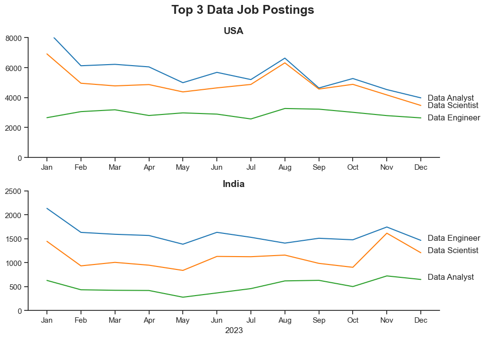
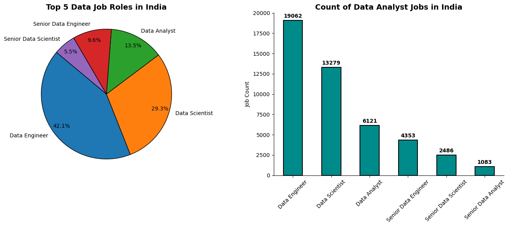

# FROM DATA TO DECISIONS: DECODING A DATA CAREER IN INDIA
---
<sup><sub><u>DISCLAIMER</u>
<i>This project is based on the Hugging Face dataset collated via an [API](https://datanerd.tech/) created by [Luke Barousse](https://www.youtube.com/@LukeBarousse) and is intended to be indicative of real-life job postings data, but doesn't account for all possible job postings in the Indian market. This project is carried out using the data available only from this particuliar API, which serves as a sample dataset of the Indian job market.</i></sup><sub>

---

## PURPOSE OF PROJECT

I am Akshay Ramesh, a seasoned professional with four years of experience spanning Growth, Operations, and Data. Currently navigating a career transition, I have discovered a deep passion for working with data. My previous role as an MIS Analyst at a leading EdTech company in India allowed me to work extensively with large datasets and powerful analytical tools like Tableau and Excel/Sheets. Over two years, I collaborated cross-functionally, developing dashboards, ad-hoc trackers, and executive reports for the CEO. The insights I generated contributed to revenue growth, optimized marketing campaigns, and enhanced partnership programs, reinforcing my passion for data-driven decision-making.

However, as I explored new opportunities, I recognized a critical skills gap in comparison to market expectations—particularly in coding. While I had a foundational understanding of SQL and Python, delving deeper into these tools unveiled their immense potential in data manipulation, automation, and engineering workflows. This realization set me on a strategic path: beginning as a Data Analyst and progressing toward a Data Engineering role.

Yet, several key questions remain:
- Is the Data Analyst role still in demand, or is the market saturated?
- What skills do I need to gain a competitive edge?
- Will AI advancements replace Data Analysts?
- Does my planned transition from Data Analyst to Data Engineer hold long-term potential?

This project aims to analyze the current landscape of Data Analyst roles in India, assess industry demand, and evaluate whether this career trajectory remains a viable and strategic choice. Through data-driven insights, I seek to validate my career path and equip myself with the optimal skill set for long-term success in the data domain.

---

## OBJECTIVE
The objective of this project is to analyze the Indian data jobs market and assess the demand for Data Analysts in comparison to other data-related roles. By examining job trends, industry requirements, and market competition, this study aims to determine whether pursuing a Data Analyst career in India is a viable and strategic choice.

This analysis will provide insights into:

- The demand and growth trends for Data Analyst roles compared to other data-centric positions.
* How Data Analysts fare against alternative career paths in the current job market.
- The essential skills and tools required to remain competitive.

By uncovering these insights, this project will help validate the feasibility of transitioning into a Data Analyst role as a stepping stone towards a future in Data Engineering.

---

## DATASET

To begin, let's look at the [dataset](https://www.youtube.com/@LukeBarousse)  we will be working with, by first installing/importing all the required libraries. Once that is done, we can load the dataset from the [API](https://datanerd.tech/).

Since we are working with a Hugging Face dataset, we shall convert the training portion of the dataset into a <u>Pandas DataFrame</u> for easier manipulation.

Then we shall convert the column ```job_posted_date``` into datetime format for simpler operations as proper datetime objects, instead of plain text or strings. For similar reasons, we are converting ```job_skills``` from a stringified list/dict into actual Python lists/dicts.

Below is the code for this task:


```python
!pip install datasets # installation for jupyter notebook
import numpy as np
import pandas as pd
import matplotlib.pyplot as plt
import seaborn as sns
import ast
from datasets import load_dataset

dataset = load_dataset('lukebarousse/data_jobs')
df = dataset['train'].to_pandas()

df['job_posted_date'] = pd.to_datetime(df['job_posted_date'])
df['job_skills'] = df['job_skills'].apply(lambda x: ast.literal_eval(x) if pd.notna(x) else x)

df.sample(7)
```

The above code shows us a sample output of the dataframe we will be working with on this project:
|index|job\_title\_short|job\_title|job\_location|job\_via|job\_schedule\_type|job\_work\_from\_home|search\_location|job\_posted\_date|job\_no\_degree\_mention|job\_health\_insurance|job\_country|salary\_rate|salary\_year\_avg|salary\_hour\_avg|company\_name|job\_skills|job\_type\_skills|
|---|---|---|---|---|---|---|---|---|---|---|---|---|---|---|---|---|---|
|103989|Machine Learning Engineer|Predictive Analyst II\*|Warwick, RI|via Farmers Insurance|Full-time|false|New York, United States|2023-01-07 00:00:08|false|true|United States|null|NaN|NaN|Farmers Insurance Careers|sql,sas,sas,python,r,watson,spss|\{'analyst\_tools': \['sas', 'spss'\], 'cloud': \['watson'\], 'programming': \['sql', 'sas', 'python', 'r'\]\}|
|9990|Software Engineer|Lead Data Software Engineer|Ukraine|via LinkedIn|Full-time|false|Ukraine|2023-06-26 13:42:19|false|false|Ukraine|null|NaN|NaN|EPAM Systems|python,azure,databricks,aws,gcp,graphql|\{'cloud': \['azure', 'databricks', 'aws', 'gcp'\], 'libraries': \['graphql'\], 'programming': \['python'\]\}|
|583022|Data Engineer|Data Engineer \(GCP\), 12-Month Contract, Work from Home in India|Anywhere|via LinkedIn|Full-time|true|India|2023-05-04 09:15:41|true|false|India|null|NaN|NaN|Xcede|gcp,kubernetes|\{'cloud': \['gcp'\], 'other': \['kubernetes'\]\}|
|437381|Data Scientist|Principal Data Scientist|Austin, TX|via BeBee|Full-time|false|Sudan|2023-08-15 16:50:51|false|true|Sudan|null|NaN|NaN|Visa International Service Association|golang,java,python,hadoop,spark|\{'libraries': \['hadoop', 'spark'\], 'programming': \['golang', 'java', 'python'\]\}|
|771360|Data Scientist|Senior Staff Data Scientist|Washington, DC|via BeBee|Full-time|false|New York, United States|2023-09-19 01:02:32|false|true|United States|null|NaN|NaN|Coupang|python,java,c,pytorch,tensorflow,keras,pyspark|\{'libraries': \['pytorch', 'tensorflow', 'keras', 'pyspark'\], 'programming': \['python', 'java', 'c'\]\}|
---
## Questions to be explored:

<font size= 4>1. How many tech jobs are currently available on the Indian market? How many of them are in the data domain?</font>

<font size=4>2. Which job roles have the highest demand?</font>

<font size=4>3. What is the monthly trend of the top job postings in the Data domain?</font>

<font size=4>4. Which are the most in-demand skills for Data Analysts in the Indian market? Which of them are the most optimal?</font>

<font size=4>5. Which data jobs are the highest paid in India?</font>

<font size=4>6. Which companies post the most jobs in India?</font>

<font size=4>7. How many jobs have remote (work from home) opportunities?</font>

<font size=4>8. What are the types of skills in demand?</font>

<font size=4>9. Which platform has more data roles posted?</font>

<font size=4>10. What portion of the market offers health insurance?</font>

<font size=4>11. Which locations in India have the highest Data Analyst job opportunities?</font>

<font size=4>12. How does India compare to other countries like USA, in terms of pay and count of job postings?

---

#### Reference Links
[Notebook 1](EDA_Data_Jobs_India.ipynb): ```EDA_Data_Jobs.ipynb```
[Notebook 2](Data_Jobs_in_India.ipynb): ```Data_Jobs_in_India.ipynb```
[Notebook 3](Highest_Paid_Jobs_India.ipynb): ```Highest_Paid_Jobs_India.ipynb```
[Notebook 4](Data_Skills_Demand_India.ipynb): ```Data_Skills_Demand_India.ipynb```
[Notebook 5](Optimal_Skills.ipynb): ```Optimal_Skills```
[Hugging Face Dataset](https://huggingface.co/datasets/lukebarousse/data_jobs)
[API](datanerd.tech)

---
## EXPLORATORY DATA ANALYSIS

Before delving into these critical questions, we will first conduct **Exploratory Data Analysis (EDA)** to gain a comprehensive understanding of the dataset. This preliminary analysis will help us assess the **structure, distribution, and characteristics** of the data, enabling us to identify key patterns and insights. By doing so, we can determine the most relevant aspects to analyze, ensuring a **targeted and data-driven approach** to answering our research questions.

---


### Which locations in India have the highest Data Analyst job opportunities?

```python
df_DA_india = df[(df['job_country'] == 'India') &(df['job_title_short'] == 'Data Analyst')].copy()
df_DA_india.groupby('job_via')['salary_year_avg'].agg(['count' , 'median']).sort_values(by= 'count' , ascending= False) # we have limited salary data to work with; limited to data salary from Ai-Jobs.net

sns.set_theme(style= 'ticks')

df_plot = df_DA_india['job_location'].value_counts(ascending= False).head(10).to_frame()

ax = sns.barplot(data= df_plot, x= 'count', y= 'job_location', hue= 'count', palette= 'dark:b_r', legend= False)
sns.despine()

for bar in ax.containers:
  ax.bar_label(bar, padding= 3, fmt= '%d', fontsize= 10, fontweight= 'semibold')

plt.xlabel('Count')
plt.ylabel('')
plt.title('Locations with Highest Job Postings')
plt.show()
```


**Dominance of pan-India openings:** Pan-India opportunities grab the highest number of job postings with 2056, indicating a robust job market and a significant demand for talent across various sectors.

**Hyderabad as a Key Hub:** Hyderabad, Telangana, stands out with 1289 job postings, suggesting it is a major employment hub within India, possibly due to its thriving IT and tech industries.

**Remote Work Opportunities:** The "Anywhere" category with 1052 job postings highlights the growing trend of remote work, reflecting a shift in work culture post-pandemic.

**Bengaluru's Significance:** Bengaluru, Karnataka, with 355 job postings, reinforces its reputation as India's Silicon Valley, attracting numerous tech and startup companies.

**Maharashtra's Contribution:** Maharashtra, including cities like Mumbai (133) and Pune (119), shows substantial job opportunities, indicating its economic importance and diverse industrial base.

**Emerging Cities:** Cities like Gurugram (108) and Chennai (106) are also notable, suggesting their growing influence in the job market, possibly due to infrastructure development and business-friendly policies.

**Regional Distribution:** The data shows a concentration of job postings in southern and western parts of India, which could be due to better infrastructure, educational institutions, and industrial presence in these regions.

---

### How many jobs have remote (Work From Home) opportunities?

```python
fig, ax = plt.subplots(1,2)

dict_column = {
    'job_work_from_home' : 'Work From Home',
    'job_no_degree_mention' : 'Degree Requirement'
}

for i, (column, title) in enumerate(dict_column.items()):
  ax[i].pie(df_DA_india[column].value_counts(), startangle= 90, autopct= '%1.1f%%', labels= ['No' , 'Yes'])
  ax[i].set_title(title, fontweight= 'bold')
```

Less than a fifth of the postings are WFH while nearly 65% jobs don't require a degree.

---

### Which companies post the most jobs in India?
```python
top_companies_postings = df_DA_india['company_name'].value_counts(ascending= False).head(10).to_frame()

sns.set_theme(style= 'ticks')

ax = sns.barplot(data= top_companies_postings, x='count', y='company_name', palette= 'dark:b_r', hue= 'count', legend= False)
sns.despine()
for bar in ax.containers:
  ax.bar_label(bar, padding= 3, fmt= '%d', fontweight= 'semibold')
ax.set_title('Count of Data Analyst Postings by Companies', fontweight= 'bold', fontsize= 16)
ax.set_ylabel('')
ax.set_xlabel('Count')

plt.tight_layout()
plt.show()
```


---

### How does India compare to other countries like USA, in terms of pay and count of job postings?
##### India vs USA Analysis

Now let's divide the datasets accoring to the country of the job posting to get country-specific insights:
```python
df_india = df[df['job_country'] == 'India'].copy()
df_india_data = df_india[df_india['job_title_short'].str.contains('data', na= False, case= False)].copy()

df_usa = df[df['job_country'] == 'United States'].copy()
df_DA_usa = df_usa[df_usa['job_title_short'] == 'Data Analyst'].copy()
```

#### 1. Salary Distribution
##### USA
```python
import seaborn as sns
usa_salary_dist = sns.histplot(data= df_DA_usa['salary_year_avg'],bins= 50, kde= True, color= 'seagreen')

plt.title('Salary Distribution of Data Analysts in the USA')
plt.xlabel('Yearly Salary')

ax = plt.gca()
ax.xaxis.set_major_formatter(lambda x, pos: f'${int(x/1000)}K')

plt.tight_layout()
plt.show()
```


---

##### India
```python
india_salary_dist = sns.histplot(data= df_DA_india['salary_year_avg'],bins= 50, kde= True)

plt.title('Salary Distribution of Data Analysts in India')
plt.xlabel('Yearly Salary')

ax = plt.gca()
ax.xaxis.set_major_formatter(lambda x, pos: f'${int(x/1000)}K')

plt.tight_layout()
plt.show()
```


To better understand the differences, we can have the two graphs juxtaposed:
```python
sns.histplot(data= df_DA_usa['salary_year_avg'], bins= 50, kde= True, color= 'seagreen')
sns.histplot(data=df_india['salary_year_avg'], bins= 50, kde= True)

ax = plt.gca()
ax.xaxis.set_major_formatter(lambda x, pos: f'${int(x/1000)}K')

plt.title('Salary Distribution of Jobs in USA vs India')
plt.xlabel('Yearly Salary')
plt.xlim(0, 400000)

plt.legend()
plt.show()
```

**Higher Salary Range in USA:** The chart indicates that data analysts in the USA generally earn higher salaries, with a significant portion in the 100K−200K range.

**Lower Salary Range in India:** In contrast, data analysts in India predominantly earn salaries in the lower range, mostly below $50K.

**Wide Disparity:** There is a notable salary disparity between the two countries, with the USA offering substantially higher compensation compared to India.

**Market Differences:** The salary distribution reflects differences in economic conditions, cost of living, and demand for data analysts between the USA and India.

**Potential for Growth:** The lower salary range in India may indicate potential for growth and increased demand for data analysts as the market evolves.

---

#### 2. Number of Job Postings

```python
usa_data_jobs = df_usa[df_usa['job_title_short'].str.contains('Data' , na= False, case= False)].copy()
india_data_jobs = df_india[df_india['job_title_short'].str.contains('Data' , na= False, case= False)].copy()

usa_data_jobs_grouped = usa_data_jobs.groupby('job_title_short').size().sort_values(ascending= False).to_frame()
india_data_jobs_grouped = india_data_jobs.groupby('job_title_short').size().sort_values(ascending= False).to_frame()

usa_data_jobs_grouped.reset_index()
usa_data_jobs_grouped.rename(columns= {usa_data_jobs_grouped.columns[0] : 'Count'}, inplace= True)

india_data_jobs_grouped.rename(columns= {india_data_jobs_grouped.columns[0] : 'Count'}, inplace= True)

sns.set_theme(style= 'ticks')

sns.barplot(data= usa_data_jobs_grouped, x= 'job_title_short' , y= 'Count')
sns.barplot(data= india_data_jobs_grouped, x= 'job_title_short' , y= 'Count')

# ax = plt.gca()
plt.title('Top Data Job Postings in USA vs India')
plt.xticks(rotation= 45)
plt.xlabel('')
plt.tight_layout()
plt.show()
```


1. **High Demand for Data Analysts**  
   - The **Data Analyst** role has the highest number of job postings among all titles.  
   - This suggests strong demand for entry/mid-level analytical roles in both countries.  

2. **Data Science and Engineering are Also Prominent**  
   - **Data Scientist** and **Data Engineer** roles have significant job postings, indicating a balanced demand for analytical and engineering expertise.  
   - Data Engineering roles appear to have **higher postings than Data Science** in this dataset.  

3. **Senior Roles Have Fewer Openings**  
   - **Senior Data Engineer, Senior Data Scientist, and Senior Data Analyst** roles have noticeably fewer job postings.  
   - This is expected since senior positions require experience, and fewer such positions are available at any given time.  

4. **Potential Geographic Hiring Trends**   
   - There might be **higher demand for junior roles in India** while senior roles might be more prevalent in the USA.  

--- 

### What is the monthly trend of the top job postings in the Data domain?

```python
df_india1 = df_india.copy()
df_india1['job_posted_month_no'] = df_india['job_posted_date'].dt.month

df_india_pivot = df_india1.pivot_table(index= 'job_posted_month_no', columns= 'job_title_short', aggfunc= 'size', fill_value= 0)
df_india_pivot.loc['Total'] = df_india_pivot.sum()
df_india_pivot = df_india_pivot[df_india_pivot.loc['Total'].sort_values(ascending= False).index]
df_india_pivot = df_india_pivot.drop('Total')

df_india_pivot = df_india_pivot.reset_index()
df_india_pivot = df_india_pivot.set_index('job_posted_month_no')
df_india_pivot['job_posted_month'] = df_india_pivot['job_posted_month_no'].apply(lambda x: pd.to_datetime(x, format= '%m').strftime('%b'))

df_india_pivot = df_india_pivot.set_index('job_posted_month')
df_india_pivot = df_india_pivot.drop(columns= 'job_posted_month_no')
df_india_plot = df_india_pivot.iloc[:, :3]
```
Output:

We have the required data, now we can plot the graph.
```python
sns.set_theme(style= 'ticks')
sns.lineplot(data= df_india_plot, palette= 'tab10', dashes= False)
plt.legend().remove()
sns.despine()

for i in range(3):
    plt.text(11.2, df_india_plot.iloc[-1,i], df_india_plot.columns[i])

plt.title('Top 3 Monthly Data Job Postings in India', fontweight= 'bold', fontsize= 14)
plt.xlabel('2023')
plt.ylim(0, 2250)
plt.tight_layout()
plt.show()
```


```python
df_usa1 = df_usa.copy()
df_usa1['job_posted_month_no'] = df_usa1['job_posted_date'].dt.month

df_usa_pivot = df_usa1.pivot_table(
    index= 'job_posted_month_no',
    columns= 'job_title_short',
    aggfunc= 'size',
    fill_value= 0
)

df_usa_pivot.loc['Total'] = df_usa_pivot.sum()
df_usa_pivot = df_usa_pivot[df_usa_pivot.loc['Total'].sort_values(ascending= False).index]
df_usa_pivot = df_usa_pivot.drop('Total')

df_usa_pivot = df_usa_pivot.reset_index()
df_usa_pivot['job_posted_month'] = df_usa_pivot['job_posted_month_no'].apply(lambda x: pd.to_datetime(x, format= '%m').strftime('%b'))
df_usa_pivot = df_usa_pivot.set_index('job_posted_month')
df_usa_pivot = df_usa_pivot.drop(columns= ['level_0' , 'index', 'job_posted_month_no'])
df_usa_plot = df_usa_pivot.iloc[:, :3]


sns.set_theme(style= 'ticks')
sns.lineplot(data= df_usa_plot, palette= 'tab10', dashes= False, legend= False)
sns.despine()

for i in range(3):
    plt.text(11.2, df_usa_plot.iloc[-1,i], df_usa_plot.columns[i])

plt.title('Top 3 Monthly Data Job Postings in USA', fontweight= 'bold', fontsize= 14)
plt.xlabel('2023')
plt.ylim(0, 9000)
plt.tight_layout()
plt.show()
```


```python
sns.set_theme(style= 'ticks')
fig, axes = plt.subplots(2,1 , figsize = (10,7))

ax1= sns.lineplot(data= df_usa_plot, palette= 'tab10', dashes= False, legend= False, ax= axes[0])
axes[0].set_title('USA', fontweight= 'semibold', size= 14)
axes[0].set_xlabel('')
axes[0].set_ylim(0, 8000)
for i, txt in enumerate(df_usa_plot.columns):
    ax1.text(11.2, df_usa_plot.iloc[-1, i], df_usa_plot.columns[i], ha= 'left', va= 'center')

ax2 = sns.lineplot(data= df_india_plot, palette= 'tab10', dashes= False, legend= False, ax= axes[1])
axes[1].set_title('India', fontweight= 'semibold', size= 14)
axes[1].set_xlabel('2023')
axes[1].set_ylim(0,2500)
for i, txt in enumerate(df_india_plot.columns):
    ax2.text(11.2, df_india_plot.iloc[-1, i], df_india_plot.columns[i], ha= 'left', va= 'center')

# for i, txt in enumerate(df['Data Engineer']):
#     ax1.text(df['Month'][i], df['Data Engineer'][i], str(txt), ha='center', va='bottom')

plt.suptitle('Top 3 Data Job Postings',fontweight= 'bold', size= 18)
sns.despine(ax=ax1)
sns.despine(ax=ax2)

plt.subplots_adjust(hspace=0.6)
plt.tight_layout()
```


**Data Engineer:** The demand for Data Engineers peaks in November, with over 2500 job postings, indicating a strong end-of-year hiring push. The lowest demand is observed in May, with around 1384 postings.

**Data Scientist:** Data Scientist roles show a significant increase in November, with 1614 postings, suggesting a similar end-of-year trend. The demand is relatively stable but dips slightly in May.

**Data Analyst:** Data Analyst postings are more consistent, with a peak in November (722 postings) and a low in May (278 postings). This role shows less variability compared to the other two.

More details on the above analysis can be found in this [notebook](EDA_Data_Jobs_India.ipynb).

We have got a fair understanding of the data at our disposal. Now let's tackle the questions we framed earlier.

---

### How many tech jobs are currently available in the Indian market?
```python
print(f'There are {len(df_india)} tech jobs available in the dataset.')
```
Output: 

---

### How many jobs are posted for each unique role?
```python
ax = df_india['job_title_short'].value_counts(ascending= True).plot(kind='barh')
plt.ylabel('')
ax.bar_label(ax.containers[0], padding= 3, fmt= '%d', fontweight= 'medium')
plt.title('Tech Job Postings in India', fontweight= 'semibold' , fontsize= 15)

for spine in ['top' , 'right']:
  ax.spines[spine].set_visible(False)

plt.show()
```


<font size= 4> It is interesting to note that Data roles are more in demand than conventional Software Developer roles!</font>

---

### Which job roles have the highest demand?

Let's explore the top data roles in the country:

```python
job_count = df_india['job_title_short'].value_counts(ascending= False).head(5)

job_titles = job_count.index
job_values = job_count.values

plt.pie(
    job_values,
    labels=job_titles,
    autopct='%1.1f%%',
    pctdistance=0.85,
    wedgeprops={'edgecolor': 'black'},
    # labeldistance= 1.2,
    textprops={'fontsize': 10, 'fontweight': 'semibold'},
    startangle=140
)

plt.gca().set_aspect('equal')
plt.title("Top 5 Data Job Roles in India", fontweight='bold')

plt.show()

# Add leader lines (ticks)
# plt.legend(title="Job Roles", loc="best", bbox_to_anchor=(1, 1))  # Optional legend
```

The Data Engineering domain captures 42% of the job postings while Data Analyst roles account only for a third of that figure.

---

### Which are the top jobs available in the data domain?

```python
df_india_data = df_india[df_india['job_title_short'].str.contains('Data', case= False, na= False)]
data_jobs = df_india_data.groupby('job_title_short').size().sort_values(ascending= False)

ax = data_jobs.plot(kind='bar', color='lightblue', edgecolor='black', linewidth=1.5)

ax.bar_label(ax.containers[0], fmt='%d', padding=3, fontsize=10, fontweight='bold')

for spine in ['top', 'right']:
  ax.spines[spine].set_visible(False)

plt.title('Count of Data Jobs in India', fontsize= 14, fontweight= 'bold')
plt.xlabel('')
plt.xticks(rotation= 45, ha= 'right')
plt.show()
```


---

### Which are the most in-demand skills for top Data roles in the Indian market?

```python
df_india_data_exploded = df_india_data.explode('job_skills')
df_india_data_skills = df_india_data_exploded.groupby(['job_skills' , 'job_title_short']).size()
df_india_data_skills = df_india_data_skills.reset_index(name= 'skills_count')
data_skills_count = df_india_data_skills.sort_values(by= 'skills_count' , ascending= False)
job_titles = data_skills_count['job_title_short'].unique().tolist()
job_titles = sorted(job_titles[:3])

fig , ax = plt.subplots(len(job_titles) , 1)

for i, job_title in enumerate(job_titles):
  df_plot = data_skills_count[data_skills_count['job_title_short'] == job_title].head(5).sort_values('skills_count' , ascending= True)
  bars = df_plot.plot(kind= 'barh', x='job_skills' , y= 'skills_count' , title= job_title , ax=ax[i], legend= False , color = 'darkcyan', edgecolor= 'black')
  ax[i].set_title(job_title, fontdict={'fontsize': 12})
  ax[i].bar_label(bars.containers[0], fmt='%d', padding=3, fontsize=10, fontweight='medium')
  ax[i].set_ylabel('')
  for spine in ['top' , 'right']:
    ax[i].spines[spine].set_visible(False)

fig.suptitle(f'Skills Demand for the Top {len(job_titles)} Data Jobs in India' , fontweight= 'bold')
fig.tight_layout()
```


---

### Which jobs are the highest paid in India?
```python
df_india = df[df['job_country'] == 'India'].copy()
df_india = df_india.dropna(subset= ['salary_year_avg'])
job_titles = df_india['job_title_short'].value_counts().index[:7].tolist()
df_india_top7 = df_india[df_india['job_title_short'].isin(job_titles)]
job_order = df_india_top7.groupby('job_title_short')['salary_year_avg'].median().sort_values(ascending= False).index.to_list()

import seaborn as sns

sns.boxplot(data= df_india_top7, x= 'salary_year_avg', y= 'job_title_short', order= job_order)

ax = plt.gca()
ax.xaxis.set_major_formatter(plt.FuncFormatter(lambda x, pos: f'{int(x/1000)}K'))

plt.title('Salary Distribution Amongst Top Jobs in India')
plt.xlabel('')
plt.ylabel('')
plt.xlim(0, 300000)
plt.show()
```


#### Insights
**Salary Range Variation:** The chart shows a wide variation in salary distribution among top data roles in India. Roles like Senior Data Scientist and Machine Learning Engineer tend to have higher salary ranges, often extending up to 
200K or more, while Data Analyst roles generally fall in the lower range, typically below 200K or more, while Data Analyst roles generally fall in the lower range, typically below $100K.

**High Demand for Senior Roles:** Senior positions such as Senior Data Scientist and Senior Data Engineer command higher salaries, reflecting the premium placed on experience and advanced skills in the job market.

**Emerging Roles:** Roles like Machine Learning Engineer and Data Engineer show competitive salaries, indicating the growing importance of specialized skills in data engineering and machine learning.

**Entry-Level Positions:** Data Analyst roles, often considered entry-level in the data field, have the lowest salary range, which is consistent with the lower experience and skill requirements for these positions.

**Software Engineer Comparison:** Software Engineers, while not exclusively data roles, are included for comparison and show a competitive salary range, often overlapping with Data Engineers and Data Scientists, indicating the cross-functional demand for software skills in data roles.

**Software Engineers** have the lowest median salary, but a few individuals earn very high salaries (outliers).

**Data Analysts** tend to have a lower median salary and a more compact range, meaning salaries are less spread out.

##### Senior Data Engineers
The median salary for **Senior Data Engineers** is relatively high, suggesting that most professionals in this role earn well. The median is positioned towards the upper half of the box, indicating that more salaries are concentrated in the higher range.

##### Salary Variation (Interquartile Range - IQR)
The box is moderately wide, meaning there is some variation in salaries, but it’s not extreme.
This suggests that while salaries for Senior Data Engineers differ, they are somewhat predictable within a range.

##### Outliers
There are multiple outliers on the higher end, indicating that some Senior Data Engineers earn significantly higher salaries than the rest.
This could be due to differences in experience, location, or working in top-paying companies.

##### Whiskers (Min & Max Salaries)
- The upper whisker extends well beyond the box, suggesting that a good number of Senior Data Engineers earn above the 75th percentile.
- The lower whisker is relatively shorter, meaning very few Senior Data Engineers earn significantly below the average.
Conclusion
- Senior Data Engineers generally earn well with a high median salary.
- There is moderate variation in salaries, with some earning significantly higher amounts.
- If you’re targeting this role, moving towards the top 25% or outlier range may require specialized skills, experience, or working at top firms.

---

### Which are the most in-demand skills for Data Analysts? 

<font size= 4>Median Salary vs Skill for Data Analysts</font>

```python
df_india_data = df_india[df_india['job_title_short'] == 'Data Analyst'].copy()
df_india_data_exploded = df_india_data.explode('job_skills')

df_india_top_skills = df_india_data_exploded.groupby('job_skills')['salary_year_avg'].agg(['count' , 'median']).sort_values(by= 'count' , ascending= False)
df_india_top_skills = df_india_top_skills.head(10).sort_values(by= 'median' , ascending= False)

sns.set_theme(style= 'ticks')
ax = sns.barplot(data= df_india_top_skills, x= 'median', y= df_india_top_skills.index, hue= 'median', palette= 'dark:b_r', legend= False)
ax.set_title('Top 10 Most In-demand Skills for Data Analysts')
ax.set_xlim(0, 120000)
ax.set_xlabel('Median Salary')
ax.set_ylabel('')
ax.xaxis.set_major_formatter(plt.FuncFormatter(lambda x, pos: f'${int(x/1000)}K'))

plt.tight_layout()
plt.show()
```


```python
df_india_top_pay = df_india_data_exploded.groupby('job_skills')['salary_year_avg'].agg(['count' , 'median']).sort_values(by= 'median' , ascending= False)
df_india_top_pay = df_india_top_pay.head(10)
import seaborn as sns

sns.set_theme(style= 'ticks')

fig , ax = plt.subplots(2,1)

sns.barplot(data= df_india_top_pay, x= 'median', y= df_india_top_pay.index, ax= ax[0], hue= 'median', palette= 'dark:b_r')
ax[0].legend().remove()

ax[0].set_title('Top 10 Highest Paid Skills for Data Analysts')
ax[0].set_xlim(0,170000)
ax[0].set_xlabel('')
ax[0].set_ylabel('')
ax[0].xaxis.set_major_formatter(plt.FuncFormatter(lambda x, pos: f'${int(x/1000)}K'))

sns.barplot(data= df_india_top_skills, x= 'median', y= df_india_top_skills.index, ax= ax[1], hue= 'median', palette= 'dark:b_r', legend= False)
ax[1].set_title('Top 10 Most In-demand Skills for Data Analysts')
ax[1].set_xlim(ax[0].get_xlim())
ax[1].set_xlabel('Median Salary ($)')
ax[1].set_ylabel('')
ax[1].xaxis.set_major_formatter(plt.FuncFormatter(lambda x, pos: f'${int(x/1000)}K'))

fig.tight_layout()
plt.show()
```


---

### Which are the most optimal skills?

```python
df_DA_india = df[(df['job_country'] == 'India') & (df['job_title_short'] == 'Data Analyst')].copy()
df_DA_india = df_DA_india.dropna(subset= 'salary_year_avg')
df_DA_india_exploded = df_DA_india.explode('job_skills')
df_DA_india_exploded[['job_skills' , 'salary_year_avg']].head(10)
df_DA_skills = df_DA_india_exploded.groupby('job_skills')['salary_year_avg'].agg(['count' , 'median']).sort_values(by= 'count' , ascending= False)
df_DA_skills = df_DA_skills.rename(columns= {'count': 'skills_count' , 'median': 'median_salary'})
df_DA_skills['skill_percent'] = df_DA_skills['skills_count'] / DA_job_count * 100
skill_percent = 6

df_DA_skills_high_demand = df_DA_skills[df_DA_skills['skill_percent'] > skill_percent]

df_DA_skills_high_demand.plot(x= 'skill_percent' , y= 'median_salary' , kind= 'scatter')

texts = []

for i, txt in enumerate(df_DA_skills_high_demand.index):
  texts.append(plt.text(df_DA_skills_high_demand['skill_percent'].iloc[i] , df_DA_skills_high_demand['median_salary'].iloc[i], txt, ha= 'center', va= 'center'))

!pip install adjustText
from adjustText import adjust_text
adjust_text(texts, arrowprops = dict(arrowstyle= '->' , color= 'grey'))

from matplotlib.ticker import PercentFormatter
ax = plt.gca()
ax.xaxis.set_major_formatter(PercentFormatter(decimals= 0))
ax.yaxis.set_major_formatter(plt.FuncFormatter(lambda x, pos: f'${int(x/1000)}K'))

plt.title(f'Top {len(df_DA_skills_high_demand)} Optimal Skills for Data Analysts in India')
plt.xlabel('Percentage of Data Analyst Postings')
plt.ylabel('Median Salary ($)')
plt.tight_layout()
plt.show()
```


```python
df_technology = df_DA_india['job_type_skills'].copy()
df_technology = df_technology.drop_duplicates()
df_technology = df_technology.dropna()

technology_dict = {}

for row in df_technology:
  row_dict = ast.literal_eval(row)
  for key, value in row_dict.items():
    if key in technology_dict:
      technology_dict[key] += value
    else:
      technology_dict[key] = value

for key, value in technology_dict.items():
  technology_dict[key] = list(set(value))

df_technology = pd.DataFrame(list(technology_dict.items()), columns= ['technology' , 'skills'])

df_technology = df_technology.explode('skills')
df_plot = df_DA_skills_high_demand.merge(df_technology, left_on= 'job_skills', right_on= 'skills')
df_plot_final = df_plot.head(15)

import seaborn as sns

sns.scatterplot(data= df_plot_final, x= 'skill_percent', y= 'median_salary', hue= 'technology')

texts = []
for i, txt in enumerate(df_plot_final['skills']):
  texts.append(plt.text(df_plot_final['skill_percent'].iloc[i], df_plot_final['median_salary'].iloc[i], txt, ha='center', va='center'))

from adjustText import adjust_text
adjust_text(texts, arrowprops = dict(arrowstyle= '->', color= 'grey'))

from matplotlib.ticker import PercentFormatter
ax = plt.gca()
ax.xaxis.set_major_formatter(PercentFormatter(decimals=0))
ax.yaxis.set_major_formatter(plt.FuncFormatter(lambda x, pos: f'${int(x/1000)}K'))

plt.title('Most Optimal Skills for Data Analysts in India', fontweight= 'bold', fontsize= 14)
plt.ylabel('Median Salary')
plt.xlabel('Percentage of Data Analyst Jobs')
plt.tight_layout()
plt.show()
```


---

# FINAL INSIGHTS
Building upon the analyses conducted thus far, we now distill our findings into actionable insights to uncover valuable takeaways that can help make strategic career decisions. This evaluation considers key factors such as skills, compensation trends, and industry dynamics, providing a well-rounded perspective on the Data Analyst landscape in India.

### SKILLS


#### **Skill Categories and Their Importance:**
1. **<u>Technology:</u>**

- **MongoDB:** A NoSQL database that is highly valued for handling unstructured data.

- **Oracle:** A robust relational database management system widely used in enterprises.

- **AWS and Azure:** Cloud platforms that are essential for modern data storage and processing solutions.

2. **<u>Programming:**</u>

- **Python:** A versatile programming language crucial for data analysis, automation, and machine learning.

- **R:** A statistical programming language important for data modeling and analysis.

3. **<u>Analyst Tools:</u>**

- **Power BI:** A leading data visualization tool that is highly sought after for creating interactive reports and dashboards.

- **Tableau:** Another popular data visualization tool that is widely used for data presentation.

- **Spark:** A big data processing tool that is essential for handling large datasets.

4. <u>**Cloud:**</u>

- **Azure:** Microsoft’s cloud platform, increasingly important for data storage and analytics.

- **AWS:** Amazon’s cloud platform, widely used for scalable data solutions.

5. <u>**Libraries:**</u>

Pandas, NumPy, and Scikit-learn: Python libraries that are essential for data manipulation, analysis, and machine learning.

6. <u>**Other Skills:**</u>

- **PowerPoint and Word:** Proficiency in these tools is important for creating reports and presentations.

- **Excel:** Despite being a basic tool, it remains essential for data analysis tasks.

#### Insights and Implications:
- **High Demand for Technical Skills:** There is a strong emphasis on technical skills, particularly in databases (MongoDB, Oracle), programming (Python, R), and big data processing (Spark).

- **Visualization Tools:** Mastery of visualization tools like Power BI and Tableau is crucial, as they are widely used for data presentation and decision-making.

- **Cloud Computing:** Skills in cloud platforms like Azure and AWS are increasingly important, reflecting the shift towards cloud-based data solutions.

- **Programming and Libraries:** Proficiency in programming languages and libraries is essential for data manipulation, analysis, and machine learning tasks.

- **Soft Skills and Tools:** Basic proficiency in tools like PowerPoint, Word, and Excel is also important for creating reports and presentations.

#### Recommendations:
- **Skill Development:** Aspiring Data Analysts should focus on acquiring technical skills in databases, programming, and big data processing. Additionally, mastering visualization tools and cloud platforms will enhance their marketability.

- **Continuous Learning:** Given the rapid evolution of technology, continuous learning and upskilling are crucial. Data Analysts should stay updated with the latest tools and technologies.

- **Diversification:** Diversifying skill sets to include both technical and soft skills will make Data Analysts more versatile and valuable in the job market.

---

### PAYSCALE


#### Highest Paid Skills for Data Analysts:
- **PostgreSQL:** This relational database management system is highly valued, likely due to its robustness and scalability.

- **PySpark:** Proficiency in PySpark, a tool for big data processing, commands a high salary, reflecting the demand for big data expertise.

- **GitLab:** Knowledge of GitLab, a DevOps platform, is well-compensated, indicating the importance of version control and CI/CD in data projects.

- **Linux:** Linux skills are highly paid, underscoring the need for data analysts to work in diverse environments.

- **MySQL:** Another relational database skill that is highly valued.

- **GDPR:** Understanding GDPR compliance is crucial for data handling, making it a high-paying skill.

- **MongoDB:** NoSQL database skills are in demand, reflecting the need for handling unstructured data.

- **Scala:** This programming language, often used in data engineering, is highly compensated.

- **Neo4j:** Graph database skills are niche but valuable, indicating specialized demand.

- **Databricks:** Proficiency in Databricks, a unified data analytics platform, is highly rewarded.

#### **Most In-Demand Skills for Data Analysts:**
- **Power BI:** This data visualization tool is highly sought after, reflecting the need for effective data presentation.

- **Spark:** Big data processing skills are crucial, indicating the importance of handling large datasets.

- **Tableau:** Another leading data visualization tool that is widely used.

- **Excel:** Despite being a basic tool, Excel remains essential for data analysis tasks.

- **SQL:** Mastery of SQL is fundamental for data querying and manipulation.

- **Python:** This versatile programming language is indispensable for data analysis and automation.

- **Azure:** Cloud computing skills, particularly with Azure, are increasingly important.

- **R:** Statistical programming skills are valuable for data analysis and modeling.

- **AWS:** Proficiency in AWS, another major cloud platform, is highly demanded.

- **Oracle:** Skills in Oracle databases are still relevant for many enterprises.

#### **Insights and Implications:**
- **Skill Diversification:** Data Analysts should consider diversifying their skill set to include both high-paying and in-demand skills to maximize their marketability and salary potential.

- **Technical Proficiency:** There is a clear emphasis on technical skills, particularly in data processing (Spark, PySpark), databases (PostgreSQL, MySQL, MongoDB), and programming (Python, Scala).

- **Visualization Tools:** Mastery of visualization tools like Power BI and Tableau is crucial, as they are widely used for data presentation and decision-making.

- **Cloud Computing:** Skills in cloud platforms like Azure and AWS are increasingly important, reflecting the shift towards cloud-based data solutions.

- **Compliance and Security:** Understanding GDPR highlights the growing importance of data privacy and security in data analysis roles.

---

### OTHER FACTORS

#### 1. Monthly Job Postings


**Job Posting Trends Over Time:**

The graph shows the number of job postings for each role from January to December.

There is a noticeable fluctuation in the number of postings for each role throughout the year, indicating seasonal trends in hiring.

**Most In-Demand Role:**

Data Engineer appears to be the most in-demand role, with the highest number of job postings across most months.

Data Scientist and Data Analyst roles follow, with Data Scientist generally having more postings than Data Analyst.

**Seasonal Hiring Patterns:**

The graph suggests that hiring for these roles peaks during certain months. For example, there might be a spike in job postings in the early months of the year (January-March) and again in the mid-year (June-August).

There could be a dip in postings during the end of the year (November-December), possibly due to holiday seasons and budget cycles.

**Comparative Analysis:**

Data Engineer consistently leads in job postings, indicating a strong demand for professionals with skills in data infrastructure and pipeline management.

Data Scientist roles, while slightly less in number, remain significant, reflecting the ongoing need for advanced analytics and machine learning expertise.

Data Analyst roles, though fewer, are steady, suggesting a consistent need for professionals who can interpret and visualize data.

**Implications for Job Seekers:**

Aspiring data professionals might consider focusing on acquiring skills relevant to Data Engineering, given its high demand.

Continuous learning in areas like machine learning and advanced analytics could benefit those targeting Data Scientist roles.

Data Analysts should focus on enhancing their data interpretation and business intelligence skills to remain competitive.

**Implications for Employers:**

Companies may need to strategize their hiring processes to align with the peak months to attract top talent.

There might be a need to offer competitive packages and career growth opportunities to attract and retain Data Engineers and Data Scientists.

---

#### 2. Location: India vs USA


**<u> Salary Range:</u>**

**USA:** The salary range for Data Analysts in the USA is broader, extending up to $400K. This indicates a wider variance in compensation, likely due to factors like experience, location, industry, and company size.

**India:** The salary range in India is narrower, with fewer data points extending beyond $150K. This suggests a more compressed salary structure, possibly due to different economic conditions and cost of living.

##### Higher Salary Peaks in the USA:

The USA shows a significant number of Data Analyst positions with salaries in the higher brackets (200K−400K). This reflects the higher earning potential in the USA, driven by a robust economy, higher demand for skilled professionals, and greater investment in data-driven decision-making.

**Lower Salary Peaks in India:**

In India, the majority of Data Analyst salaries are concentrated in the lower to mid-range brackets (0K−150K). This is indicative of the emerging nature of the data analytics field in India and the relatively lower cost of living.

<u>**Data Availability:**</u>

The dataset indicates that there is much more salary data available for the USA compared to India. This could be due to the more mature data analytics market in the USA, with more companies reporting salary data and a larger number of job postings. But it is predominantly because LinkedIN salary data is available via the API only for USA, while other countries have limited salary data from other websites and for India, this data is only available via [ai-jobs website](https://aijobs.net/).

---

#### Implications and Recommendations:
**Economic and Market Conditions:**

The higher salaries in the USA can be attributed to the advanced state of the data analytics industry, higher GDP, and greater investment in technology and data infrastructure.

In India, while the salaries are lower, the field is growing rapidly, and there is significant potential for salary growth as the industry matures.

**Career Opportunities:**

Data Analysts in the USA have access to higher-paying roles, especially in tech hubs like Silicon Valley, New York, and Seattle.

In India, while the salaries are lower, there are increasing opportunities in major cities like Bangalore, Hyderabad, and Pune, which are becoming hubs for IT and data analytics.

**Skill Development:**

Professionals in India might consider acquiring advanced skills and certifications to command higher salaries and compete in the global market.

Continuous learning and specialization in high-demand areas like machine learning, big data, and cloud computing can enhance earning potential in both countries.

**Global Mobility:**

For Indian Data Analysts, gaining experience in India and then exploring opportunities abroad, particularly in the USA, could be a strategic career move to leverage higher salaries.

---

#### 3. Quantity of Data Analyst Job Postings


#### **1️⃣ Distribution of Top 5 Data Job Roles in India**
This chart highlights the proportion of different **data-related roles** in India's job market.

- **Data Engineers dominate** the job market, accounting for **42.1%** of the total jobs.
- **Data Scientists** hold the second-largest share at **29.3%**, showing significant demand for this role.
- **Data Analysts** make up **13.5%**, indicating a moderate demand compared to Engineers and Scientists.
- **Senior Data Engineers** (9.6%) and **Senior Data Scientists** (5.5%) have relatively lower proportions, which suggests that senior-level roles are fewer in number.

#### **Key Takeaways:**
✅ The **Data Engineer** role is the most in-demand among data jobs in India.  
✅ **Data Science** is also a high-demand field, but it lags behind engineering roles.  
✅ **Data Analysts** have a decent market share, but their numbers are significantly lower than **Data Engineers and Data Scientists**.  
✅ **Senior roles have limited availability**, possibly due to the **experience barrier** required for these positions.


##### **2️⃣ Count of Data Analyst Jobs in India**
The second plot provides a **detailed count of job openings** for each data-related role.

- **Data Engineers have the highest job count** at **19,062**, reinforcing the insight from the pie chart.
- **Data Scientists are the second-highest**, with **13,279** openings.
- **Data Analysts have 6,121 openings**, significantly lower than the first two roles.
- **Senior roles (Senior Data Engineer, Senior Data Scientist, and Senior Data Analyst) have considerably fewer job openings**, reflecting a more selective market for experienced professionals.

#### **Key Takeaways:**
✅ **Entry to mid-level Data Engineering and Data Science roles dominate** the Indian job market.  
✅ **Data Analyst roles are available but much lower compared to Data Engineers and Scientists**—suggesting that analytics skills are valued but may not be the primary hiring focus.  
✅ **Senior positions in Data Science, Data Engineering, and Data Analysis are limited**, likely due to stricter experience and skill requirements.  

---

## **Implications for Data Analysts in India**
- Aspiring Data Analysts should **consider upskilling in Data Engineering and Data Science** to increase job opportunities.
- The **competition in Data Analyst roles is likely higher** due to the lower number of openings.
- **Transitioning from Data Analyst to Data Scientist or Data Engineer** can provide better job prospects in the long run.
- **Gaining experience to qualify for senior roles is crucial**, as opportunities for Senior Data Analysts are relatively scarce.

---

### **Notable Insights**
📌 The demand for **Data Engineers and Data Scientists** in India is significantly higher than that for Data Analysts.  
📌 **Data Analysts** have opportunities but **face stronger competition** due to the lower number of job postings.  
📌 Upskilling in areas like **Big Data, Machine Learning, and Cloud Technologies** can improve career prospects for Data Analysts looking to transition into higher-demand roles. 🚀

---

## CONCLUSION

The analysis of the Indian job market for Data Analysts has provided valuable insights into the demand, required skillsets, and potential career growth in this domain. Encouragingly, my current proficiency in **SQL, Python, Excel, and Tableau** aligns well with the skills most sought after by employers. This reinforces my confidence in securing a Data Analyst role, as these tools form the backbone of data-driven decision-making across industries.  

However, while my current skillset is optimal, expanding my expertise could unlock even greater opportunities. **Power BI**, despite not being the most optimal skill in earlier analyses, remains the most in-demand tool for Data Analysts. Given its strong market presence, adding it to my arsenal would be a strategic move. Similarly, **Looker and Apache Spark** stand out as high-paying skills, signaling their importance in the evolving data landscape. **MongoDB**, a leading NoSQL database, commands a premium salary, making it a valuable niche skill to consider.  

A key takeaway from the analysis is that **Data Analyst roles remain abundant and highly relevant**. In India, the demand for Data Engineers is currently the highest, but Data Analysts continue to hold a strong presence in the job market. This aligns well with my career trajectory, which involves progressing from **Data Analyst to Senior Data Analyst, Lead Data Analyst, and eventually transitioning into Data Engineering**.  

To ensure long-term success, I plan to deepen my expertise through real-world projects, thereby gaining hands-on experience with **Power BI, Spark, and Looker** while also familiarizing myself with key **Data Engineering concepts such as Docker and cloud-based data processing**. This will not only enhance my technical proficiency but also position me as a well-rounded professional capable of bridging the gap between **data analysis and engineering**.  

In conclusion, this project has validated my chosen career path, provided clarity on the **most valuable skills**, and highlighted areas for further growth. By continuously upskilling and adapting to market demands, I am confident in my ability to carve out a successful career in the **data domain**. 🚀

---


1️⃣ Numbered Icons:
1️⃣ 2️⃣ 3️⃣ 4️⃣ 5️⃣ 6️⃣ 7️⃣ 8️⃣ 9️⃣ 🔟

✅ Status & Checkmarks:
✅✔️☑️🔘⚡

📌 Highlights & Pinning:
📌📍🔖📝🗂️📂

🚀 Progress & Growth:
🚀📈📊📉📊💹

💡 Ideas & Insights:
💡🔍🧠📊📑📖

⚠️ Warnings & Caution:
⚠️🚨🔴⚡❗❕

📅 Time & Planning:
📅⏳⌛⏰⏱️🕰️

💻 Tech & Coding:
💻🖥️📊📉📈⌨️📟📡

🏆 Achievements & Success:
🏆🎯🥇🎖️🎉🎊

📢 Communication & Announcements:
📢📣📜🗣️🗞️

🔍 Research & Analysis:
🔍📊📈📉📋📑


