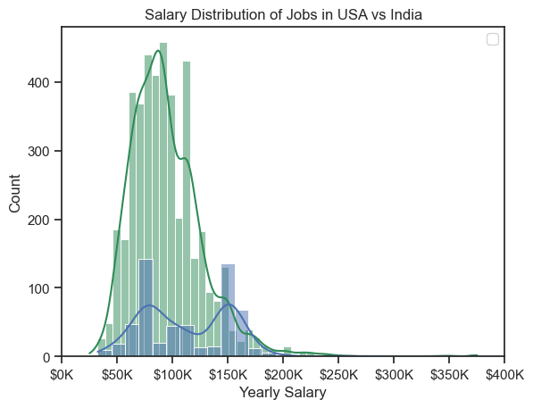
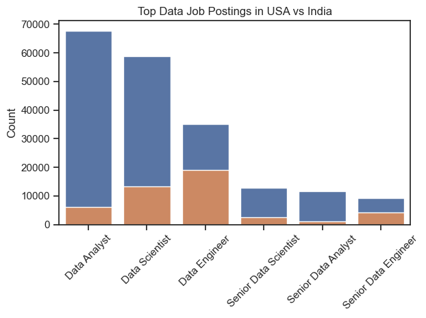
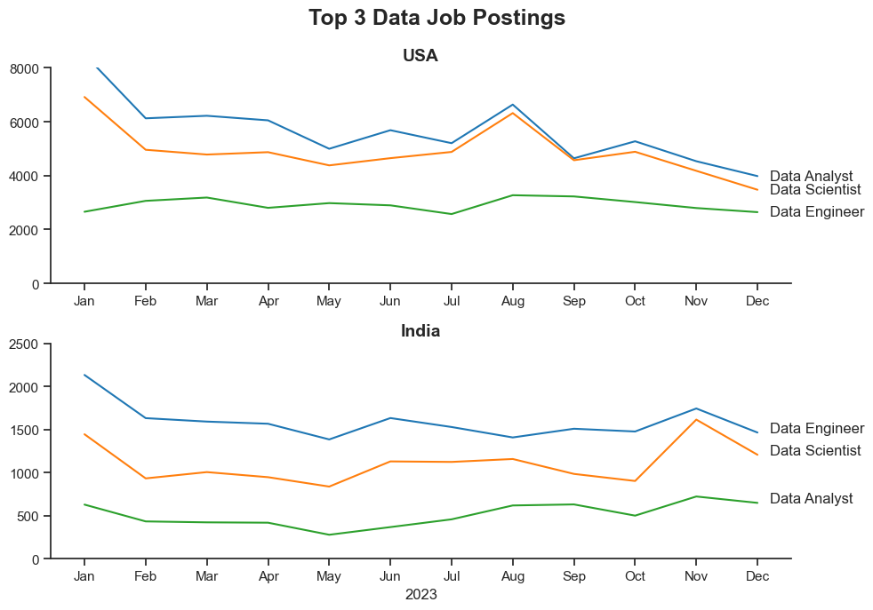
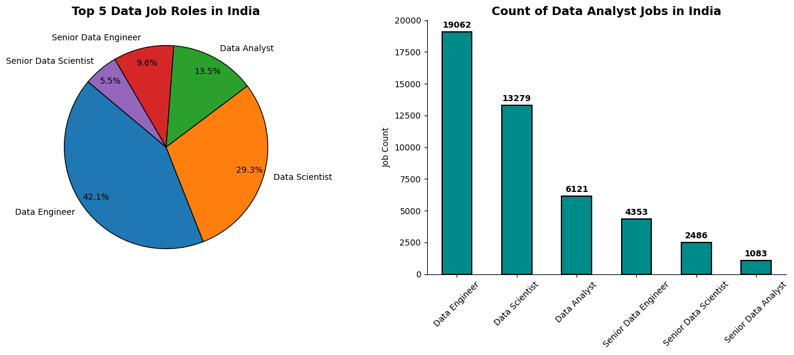
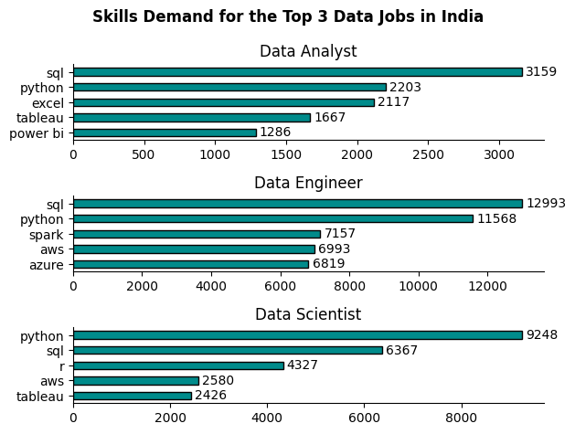
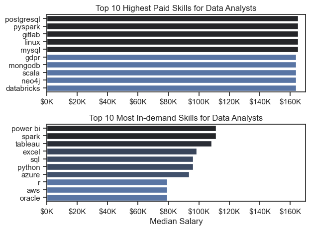
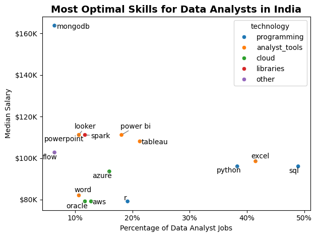

# FROM DATA TO DECISIONS: DECODING A DATA CAREER IN INDIA
<sup><sub><u>DISCLAIMER</u>
<i>This project is based on the Hugging Face dataset collated via an [API](https://datanerd.tech/) created by [Luke Barousse](https://www.youtube.com/@LukeBarousse) and is intended to be indicative of real-life job postings data, but doesn't account for all possible job postings in the Indian market. This project is carried out using the data available only from this particuliar API, which serves as a sample dataset of the Indian job market.</i></sup><sub>

---

## OBJECTIVE 🎯

To analyze the Indian data jobs market and assess the demand for **Data Analysts** in comparison to other data-related roles. By examining job trends 📊, industry requirements 🏢, and market competition 🏁, this study aims to determine whether pursuing a Data Analyst career in India is a viable and strategic choice. The aim of this analysis is to  provide a data-backed roadmap for career growth and strategic upskilling! 📊

🔎 This analysis will provide insights into:

🚀 Demand and growth trends for Data Analyst roles compared to other data-centric positions.

⚖️ How Data Analysts fare against alternative career paths in the current job market.

🛠️ The essential skills and tools required to remain competitive.

💰 Compensation insights to understand how skill choices impact earning potential.

By uncovering these insights, this project will help validate the feasibility ✅ of transitioning into a Data Analyst role as a stepping stone towards a future in Data Engineering 📟.

---

## PURPOSE OF PROJECT 📝
I am Akshay Ramesh, a seasoned professional with 4️ years of experience spanning Growth 📈, Operations ⚙️, and Data 📊. Currently navigating a career transition 🔄, I have discovered a deep passion for working with data.

💡 My previous role as an MIS Analyst at a leading EdTech company in India provided extensive exposure to large datasets 🏢 and powerful analytical tools like Tableau 📊 and Excel/Sheets 📑. Over two years, I collaborated cross-functionally, developing dashboards 📊, ad-hoc trackers 📌, and executive reports 📑 for the CEO. The insights I generated contributed to revenue growth 💰, optimized marketing campaigns 📢, and enhanced partnership programs 🤝, reinforcing my passion for data-driven decision-making 🔍.

However, as I explored new opportunities, I recognized a critical skills gap ⚠️ in comparison to market expectations—particularly in coding 💻. While I had a foundational understanding of SQL 🛢️ and Python 🐍, diving deeper unveiled their immense potential in data manipulation 🔄, automation 🤖, and engineering workflows 🔧. This realization set me on a strategic path: beginning as a Data Analyst 📊 and progressing towards a Data Engineering role 🏗️.

Yet, several key questions remain:

📉 Is the Data Analyst role still in demand, or is the market saturated?

🛠️ What skills do I need to gain a competitive edge?

🤖 Will AI advancements replace Data Analysts?

🔄 Does my planned transition from Data Analyst to Data Engineer hold long-term potential?

📌 This project aims to analyze the current landscape of Data Analyst roles in India 🇮🇳, assess industry demand 📊, and evaluate whether this career trajectory remains a viable and strategic choice 🎯. Through data-driven insights 📈, I seek to validate my career path ✅ and equip myself with the optimal skill set 🛠️ for long-term success 🚀 in the data domain.

---

## ❓ THE QUESTIONS
<font size= 4>1. How many tech jobs are currently available on the Indian market? How many of them are in the data domain?</font>

<font size=4>2. Which job roles have the highest demand?</font>

<font size=4>3. What is the monthly trend of the top job postings in the Data domain?</font>

<font size=4>4. Which are the most in-demand skills for Data Analysts in the Indian market? Which of them are the most optimal?</font>

<font size=4>5. Which data jobs are the highest paid in India?</font>

<font size=4>6. Which companies post the most jobs in India?</font>

<font size=4>7. How many jobs have remote (work from home) opportunities?</font>

<font size=4>8. What are the types of skills in demand?</font>

<font size=4>9. Which platform has more data roles posted?</font>

<font size=4>10. What portion of the market offers health insurance?</font>

<font size=4>11. Which locations in India have the highest Data Analyst job opportunities?</font>

<font size=4>12. How does India compare to other countries like USA, in terms of pay and count of job postings?</font>

---
  
## 🛠️ TOOLS I USED
🔹 Python 🐍 – For data analysis and automation

🔹 VSCode 🖥️ – For coding and script execution

🔹 Jupyter Notebooks 📒 – For interactive data exploration

🔹 ChatGPT-4.0 🤖 – For research, editing assistance, and generating insights

🔹 Deepseek R1 🧠 – For advanced AI-powered data analysis and automation

---

## 📜 DATA PREPARATION AND CLEANUP 
We will be using this [dataset](https://www.youtube.com/@LukeBarousse), by first installing/importing all the required libraries. Once that is done, we can load the dataset from the [API](https://datanerd.tech/).

Since we are working with a Hugging Face dataset, we shall convert the training portion of the dataset into a <u>Pandas DataFrame</u> for easier manipulation.

Then we shall convert the column ```job_posted_date``` into datetime format for simpler operations as proper datetime objects, instead of plain text or strings. For similar reasons, we are converting ```job_skills``` from a stringified list/dict into actual Python lists/dicts.

Below is the code for this task:

```python
!pip install datasets # installation for jupyter notebook
import numpy as np
import pandas as pd
import matplotlib.pyplot as plt
import seaborn as sns
import ast
from datasets import load_dataset

dataset = load_dataset('lukebarousse/data_jobs')
df = dataset['train'].to_pandas()

df['job_posted_date'] = pd.to_datetime(df['job_posted_date'])
df['job_skills'] = df['job_skills'].apply(lambda x: ast.literal_eval(x) if pd.notna(x) else x)

df.sample(5)
```

The above code shows us a sample output of the dataframe we will be working with on this project:
|index|job\_title\_short|job\_title|job\_location|job\_via|job\_schedule\_type|job\_work\_from\_home|search\_location|job\_posted\_date|job\_no\_degree\_mention|job\_health\_insurance|job\_country|salary\_rate|salary\_year\_avg|salary\_hour\_avg|company\_name|job\_skills|job\_type\_skills|
|---|---|---|---|---|---|---|---|---|---|---|---|---|---|---|---|---|---|
|103989|Machine Learning Engineer|Predictive Analyst II\*|Warwick, RI|via Farmers Insurance|Full-time|false|New York, United States|2023-01-07 00:00:08|false|true|United States|null|NaN|NaN|Farmers Insurance Careers|sql,sas,sas,python,r,watson,spss|\{'analyst\_tools': \['sas', 'spss'\], 'cloud': \['watson'\], 'programming': \['sql', 'sas', 'python', 'r'\]\}|
|9990|Software Engineer|Lead Data Software Engineer|Ukraine|via LinkedIn|Full-time|false|Ukraine|2023-06-26 13:42:19|false|false|Ukraine|null|NaN|NaN|EPAM Systems|python,azure,databricks,aws,gcp,graphql|\{'cloud': \['azure', 'databricks', 'aws', 'gcp'\], 'libraries': \['graphql'\], 'programming': \['python'\]\}|
|583022|Data Engineer|Data Engineer \(GCP\), 12-Month Contract, Work from Home in India|Anywhere|via LinkedIn|Full-time|true|India|2023-05-04 09:15:41|true|false|India|null|NaN|NaN|Xcede|gcp,kubernetes|\{'cloud': \['gcp'\], 'other': \['kubernetes'\]\}|
|437381|Data Scientist|Principal Data Scientist|Austin, TX|via BeBee|Full-time|false|Sudan|2023-08-15 16:50:51|false|true|Sudan|null|NaN|NaN|Visa International Service Association|golang,java,python,hadoop,spark|\{'libraries': \['hadoop', 'spark'\], 'programming': \['golang', 'java', 'python'\]\}|
|771360|Data Scientist|Senior Staff Data Scientist|Washington, DC|via BeBee|Full-time|false|New York, United States|2023-09-19 01:02:32|false|true|United States|null|NaN|NaN|Coupang|python,java,c,pytorch,tensorflow,keras,pyspark|\{'libraries': \['pytorch', 'tensorflow', 'keras', 'pyspark'\], 'programming': \['python', 'java', 'c'\]\}|

We can remove the null (NaN) values by using the dropna() function.
```df = df.dropna(subset= ['salary_year_avg'])```

Since the ```job_skills``` column is in the first of strings, we can 'explode' them to release individual skill rows to conduct further analysis on them.
```df = df.explode('job_skills')```

We can also manipulate the ```job_skills_type``` column to categorize the skills, which we will be carrying out later in the course of the project.

---

## 📊 THE ANALYSIS

### 🔎 How does India compare to other countries like the USA in terms of pay and job postings?

#### 1️⃣ Payscale

```python
sns.histplot(data= df_DA_usa['salary_year_avg'], bins= 50, kde= True, color= 'seagreen')
sns.histplot(data=df_india['salary_year_avg'], bins= 50, kde= True)

ax = plt.gca()
ax.xaxis.set_major_formatter(lambda x, pos: f'${int(x/1000)}K')

plt.title('Salary Distribution of Jobs in USA vs India')
plt.xlabel('Yearly Salary')
plt.xlim(0, 400000)

plt.legend()
plt.show()
```


#### 2️⃣ Count of Job Postings

```python
sns.set_theme(style= 'ticks')

sns.barplot(data= usa_data_jobs_grouped, x= 'job_title_short' , y= 'Count')
sns.barplot(data= india_data_jobs_grouped, x= 'job_title_short' , y= 'Count')

# ax = plt.gca()
plt.title('Top Data Job Postings in USA vs India')
plt.xticks(rotation= 45)
plt.xlabel('')
plt.tight_layout()
plt.show()
```


---

### 📅 What is the monthly trend of top job postings in the Data domain?

```python
sns.set_theme(style= 'ticks')
fig, axes = plt.subplots(2,1 , figsize = (10,7))

ax1= sns.lineplot(data= df_usa_plot, palette= 'tab10', dashes= False, legend= False, ax= axes[0])
axes[0].set_title('USA', fontweight= 'semibold', size= 14)
axes[0].set_xlabel('')
axes[0].set_ylim(0, 8000)
for i, txt in enumerate(df_usa_plot.columns):
    ax1.text(11.2, df_usa_plot.iloc[-1, i], df_usa_plot.columns[i], ha= 'left', va= 'center')

ax2 = sns.lineplot(data= df_india_plot, palette= 'tab10', dashes= False, legend= False, ax= axes[1])
axes[1].set_title('India', fontweight= 'semibold', size= 14)
axes[1].set_xlabel('2023')
axes[1].set_ylim(0,2500)
for i, txt in enumerate(df_india_plot.columns):
    ax2.text(11.2, df_india_plot.iloc[-1, i], df_india_plot.columns[i], ha= 'left', va= 'center')

# for i, txt in enumerate(df['Data Engineer']):
#     ax1.text(df['Month'][i], df['Data Engineer'][i], str(txt), ha='center', va='bottom')

plt.suptitle('Top 3 Data Job Postings',fontweight= 'bold', size= 18)
sns.despine(ax=ax1)
sns.despine(ax=ax2)

plt.subplots_adjust(hspace=0.6)
plt.tight_layout()
```


---

### 📊 How many jobs are available in the data domain?

```python
import seaborn as sns

fig, axes = plt.subplots(1, 2, figsize=(14, 6))

axes[0].pie(
    job_values,
    labels=job_titles,
    autopct='%1.1f%%',
    pctdistance=0.85,
    wedgeprops={'edgecolor': 'black'},
    # labeldistance= 1.2,
    textprops={'fontsize': 10, 'fontweight': 'light'},
    startangle=140
)
axes[0].set_title('Top 5 Data Job Roles in India', fontweight= 'bold', fontsize= 14)

data_jobs.plot(kind='bar', color='darkcyan', edgecolor='black', linewidth=1.5)
axes[1].set_title('Count of Data Analyst Jobs in India', fontweight= 'bold', fontsize= 14)
axes[1].set_xlabel('')
axes[1].set_ylabel('Job Count')
axes[1].bar_label(axes[1].containers[0], fmt='%d', padding=3, fontsize=10, fontweight='bold')


for spine in ['top', 'right']:
  axes[1].spines[spine].set_visible(False)
# axes[1].grid(True)

plt.xticks(rotation= 45)
plt.tight_layout()
plt.show()
```


---

### 💼 Which are the most in-demand skills for top Data roles in the Indian market?

```python
df_india_data_exploded = df_india_data.explode('job_skills')
df_india_data_skills = df_india_data_exploded.groupby(['job_skills' , 'job_title_short']).size()
df_india_data_skills = df_india_data_skills.reset_index(name= 'skills_count')
data_skills_count = df_india_data_skills.sort_values(by= 'skills_count' , ascending= False)
job_titles = data_skills_count['job_title_short'].unique().tolist()
job_titles = sorted(job_titles[:3])

fig , ax = plt.subplots(len(job_titles) , 1)

for i, job_title in enumerate(job_titles):
  df_plot = data_skills_count[data_skills_count['job_title_short'] == job_title].head(5).sort_values('skills_count' , ascending= True)
  bars = df_plot.plot(kind= 'barh', x='job_skills' , y= 'skills_count' , title= job_title , ax=ax[i], legend= False , color = 'darkcyan', edgecolor= 'black')
  ax[i].set_title(job_title, fontdict={'fontsize': 12})
  ax[i].bar_label(bars.containers[0], fmt='%d', padding=3, fontsize=10, fontweight='medium')
  ax[i].set_ylabel('')
  for spine in ['top' , 'right']:
    ax[i].spines[spine].set_visible(False)

fig.suptitle(f'Skills Demand for the Top {len(job_titles)} Data Jobs in India' , fontweight= 'bold')
fig.tight_layout()
```


---

### 📉 Which are the most in-demand skills for Data Analysts? 
```python
df_india_top_pay = df_india_data_exploded.groupby('job_skills')['salary_year_avg'].agg(['count' , 'median']).sort_values(by= 'median' , ascending= False)
df_india_top_pay = df_india_top_pay.head(10)

import seaborn as sns

sns.set_theme(style= 'ticks')

fig , ax = plt.subplots(2,1)

sns.barplot(data= df_india_top_pay, x= 'median', y= df_india_top_pay.index, ax= ax[0], hue= 'median', palette= 'dark:b_r')
ax[0].legend().remove()

ax[0].set_title('Top 10 Highest Paid Skills for Data Analysts')
ax[0].set_xlim(0,170000)
ax[0].set_xlabel('')
ax[0].set_ylabel('')
ax[0].xaxis.set_major_formatter(plt.FuncFormatter(lambda x, pos: f'${int(x/1000)}K'))

sns.barplot(data= df_india_top_skills, x= 'median', y= df_india_top_skills.index, ax= ax[1], hue= 'median', palette= 'dark:b_r', legend= False)
ax[1].set_title('Top 10 Most In-demand Skills for Data Analysts')
ax[1].set_xlim(ax[0].get_xlim())
ax[1].set_xlabel('Median Salary ($)')
ax[1].set_ylabel('')
ax[1].xaxis.set_major_formatter(plt.FuncFormatter(lambda x, pos: f'${int(x/1000)}K'))

fig.tight_layout()
plt.show()
```


---

### 🎯 Which are the most optimal skills?

```python
df_technology = df_DA_india['job_type_skills'].copy()
df_technology = df_technology.drop_duplicates()
df_technology = df_technology.dropna()

technology_dict = {}

for row in df_technology:
  row_dict = ast.literal_eval(row)
  for key, value in row_dict.items():
    if key in technology_dict:
      technology_dict[key] += value
    else:
      technology_dict[key] = value

for key, value in technology_dict.items():
  technology_dict[key] = list(set(value))

df_technology = pd.DataFrame(list(technology_dict.items()), columns= ['technology' , 'skills'])

df_technology = df_technology.explode('skills')
df_plot = df_DA_skills_high_demand.merge(df_technology, left_on= 'job_skills', right_on= 'skills')
df_plot_final = df_plot.head(15)

import seaborn as sns

sns.scatterplot(data= df_plot_final, x= 'skill_percent', y= 'median_salary', hue= 'technology')

texts = []
for i, txt in enumerate(df_plot_final['skills']):
  texts.append(plt.text(df_plot_final['skill_percent'].iloc[i], df_plot_final['median_salary'].iloc[i], txt, ha='center', va='center'))

from adjustText import adjust_text
adjust_text(texts, arrowprops = dict(arrowstyle= '->', color= 'grey'))

from matplotlib.ticker import PercentFormatter
ax = plt.gca()
ax.xaxis.set_major_formatter(PercentFormatter(decimals=0))
ax.yaxis.set_major_formatter(plt.FuncFormatter(lambda x, pos: f'${int(x/1000)}K'))

plt.title('Most Optimal Skills for Data Analysts in India', fontweight= 'bold', fontsize= 14)
plt.ylabel('Median Salary')
plt.xlabel('Percentage of Data Analyst Jobs')
plt.tight_layout()
plt.show()
```


---

## 📈 RESULTS AND INSIGHTS

#### **1️⃣ Distribution of Top 5 Data Job Roles in India**

🔹 **Data Engineers dominate** the job market, accounting for **42.1%** of total jobs.

🔹 **Data Scientists** hold the second-largest share at 29.3%, indicating significant demand.

🔹 **Data Analysts** make up 13.5%, reflecting a moderate demand.

🔹 **Senior roles** (Senior Data Engineer: 9.6%, Senior Data Scientist: 5.5%) are fewer, likely due to experience barriers.

#### ✅ Key Takeaways:

✔️ The **Data Engineer** role is the most in-demand in India among data jobs in India.

✔️ **Data Science** remains a high-demand field but lags behind engineering roles.

✔️ **Data Analysts** have opportunities, though significantly fewer than **Data Engineers and Scientists**.

✔️ **Senior roles have limited availability**, possibly due to the **experience barrier** required for these positions.

---

#### **2️⃣ Count of Data Analyst Jobs in India**

🔹 **Data Engineers** lead with 19,062 job openings, reinforcing their dominance.

🔹 **Data Scientists** come next, with 13,279 openings.

🔹 **Data Analysts** have 6,121 openings, much lower than Engineers and Scientists.

🔹 **Senior roles** have far fewer opportunities, indicating a selective hiring process for experienced professionals.

#### ✅ Key Takeaways:

✔️ **Entry-to-mid level Data Engineering & Data Science roles dominate** the Indian job market.

✔️** Data Analyst** roles are available but significantly fewer, highlighting **stronger competition**.

✔️ **Senior positions are scarce**, likely requiring extensive experience and specialized expertise.

---

#### 3️⃣ Highest Paid Skills for Data Analysts 💰
💡 These skills command higher salaries in the market:

🔹 **PostgreSQL** – Robust and highly valued database tool.

🔹 **PySpark** – Essential for handling big data.

🔹 **GitLab** – Knowledge of version control and CI/CD pipelines is rewarded.

🔹 **Linux** – High-paying skill, crucial for working in diverse environments.

🔹 **MySQL** – Another highly valued relational database system.

🔹 **GDPR** – Regulatory compliance expertise is a premium skill.

🔹 **MongoDB** – NoSQL databases are in demand.

🔹 **Scala** – A powerful language for big data and engineering.

🔹 **Neo4j** – Specialized graph database skill with high compensation.

🔹 **Databricks** – Unified data analytics platform, highly sought after.

---

#### 4️⃣ Most In-Demand Skills for Data Analysts 🚀
📌 These are the skills most frequently mentioned in job postings:

🔹 **Power BI** – Highly sought-after data visualization tool.

🔹 **Spark** – Big data processing is in high demand.

🔹 **Tableau** – A key visualization tool for data insights.

🔹 **Excel** – Still widely used in business intelligence.

🔹 **SQL** – Fundamental for database querying.

🔹 **Python** – Core programming language for data analysis & automation.

🔹 **Azure** – Cloud computing is becoming a key requirement.

🔹 **R** – Valuable for statistical modeling & analytics.

🔹 **AWS** – Another major cloud computing platform.

🔹 **Oracle** – Database skills still hold relevance in enterprise settings.

---

#### 5️⃣ Key Insights & Implications 🔍

📌 **Skill Diversification** – Combining high-demand and high-paying skills enhances marketability & salary potential.

📌 **Technical Proficiency** – Strong demand for big data, databases, and programming skills.

📌 **Visualization Tools** – Power BI & Tableau remain crucial for business intelligence.

📌 **Cloud Computing** – AWS & Azure expertise is increasingly valuable.

📌 **Compliance & Security** – GDPR & security skills are growing in importance.

---

#### 6️⃣ Implications for Data Analysts in India 📍

📌 Aspiring Data Analysts should **consider upskilling in Data Engineering & Data Science** to increase job opportunities.

📌 **Data Analyst roles face high competition** due to fewer openings.

📌 **Transitioning from Data Analyst to Data Engineer** or Data Scientist provides stronger career prospects.

📌 **Senior roles** are selective, requiring extensive experience.

---

#### 7️⃣ Notable Insights for Data Analysts 💡
📌 **Data Engineers & Data Scientists** have significantly higher demand than Data Analysts.

📌 **Data Analysts face higher competition** due to the lower number of job postings.

📌 **Upskilling in Big Data, Cloud Technologies, and Machine Learning** enhances long-term career prospects.

---

## 🏁 CONCLUSION 🏁
The analysis of the Indian job market 🇮🇳 for Data Analysts 📊 has provided valuable insights 🔍 into demand 📈, required skill sets 🛠️, and career growth 🚀 in this domain.

✅ Encouragingly, my current proficiency in SQL 🛢️, Python 🐍, Excel 📑, and Tableau 📊 aligns well with the most in-demand skills sought by employers. This reinforces my confidence 💪 in securing a Data Analyst role, as these tools form the backbone of data-driven decision-making 🧠 across industries.

However, while my current skillset is optimal, expanding my expertise could unlock greater opportunities 🔓:

📌 Power BI 📊, though not the most optimal skill in earlier analyses, remains the most in-demand tool for Data Analysts. Learning it would be a strategic move 🎯.

📌 Looker 👀 and Apache Spark 🔥 command high salaries 💰, signaling their importance in the evolving data landscape 🌍.

📌 MongoDB 🗄️, a leading NoSQL database, offers premium pay 💵, making it a valuable niche skill to consider.

📊 A key takeaway: Data Analyst roles remain abundant and highly relevant. In India, the demand for Data Engineers 🏗️ is currently the highest, but Data Analysts continue to hold a strong presence 💪 in the job market. This aligns well with my career trajectory:
➡️ Data Analyst 📊 → Senior Data Analyst 📈 → Lead Data Analyst 🚀 → Data Engineer 🏗️

To ensure long-term success, I plan to:

✅ Deepen my expertise through real-world projects 🏗️

✅ Gain hands-on experience with Power BI, Spark, and Looker

✅ Familiarize myself with Data Engineering concepts such as Docker 🐳 and cloud-based data processing ☁️

This will enhance my technical proficiency 📚 and position me as a well-rounded professional capable of bridging the gap between data analysis 📊 and data engineering 🏗️.

#### 🧠 FINAL THOUGHTS

This project has:

✅ Validated my chosen career path 🎯

✅ Clarified the most valuable skills 🛠️

✅ Highlighted areas for further growth 📈

By continuously upskilling 📚 and adapting to market demands 🌍, I am confident in my ability to carve out a successful career in the data domain 📊🚀.

---

## REFERENCE LINKS 📑

[Notebook 1](EDA_Data_Jobs_India.ipynb): ```EDA_Data_Jobs.ipynb```

[Notebook 2](Data_Jobs_in_India.ipynb): ```Data_Jobs_in_India.ipynb```

[Notebook 3](Highest_Paid_Jobs_India.ipynb): ```Highest_Paid_Jobs_India.ipynb```

[Notebook 4](Data_Skills_Demand_India.ipynb): ```Data_Skills_Demand_India.ipynb```

[Notebook 5](Optimal_Skills.ipynb): ```Optimal_Skills.ipynb```

[Hugging Face Dataset](https://huggingface.co/datasets/lukebarousse/data_jobs)

[API](datanerd.tech)

The complete project can be found [here](Data_Careers_Analysis_Report.md).

---

## NOTE OF THANKS 🤝

Major shoutout 🗣️ to [Luke Barousse](https://www.youtube.com/@LukeBarousse) for his Python course that enabled me to carry out the analysis involved in this project and [Kelly Adams](https://www.youtube.com/redirect?event=video_description&redir_token=QUFFLUhqblhFQU9TTFhxeGtfczVWZWQwQjNvOFZXOVdpQXxBQ3Jtc0ttNURwSTQtMy15M2NTb0pKU1ZDdmpHNkxsZTY1LThqa3FLSlRPYTJSVVFleThmQ0R0ektHOHdOdHBFdlRhUkFZUTRJUXVlNHlJTjdpeWdVMnFybVl0TzMxOTF2Sk4xczYweXRoSHdPVWZJbEtLWnpqZw&q=https%3A%2F%2Fwww.kellyjadams.com%2F&v=wUSDVGivd-8) for curating the course content 🏆🔥

---
